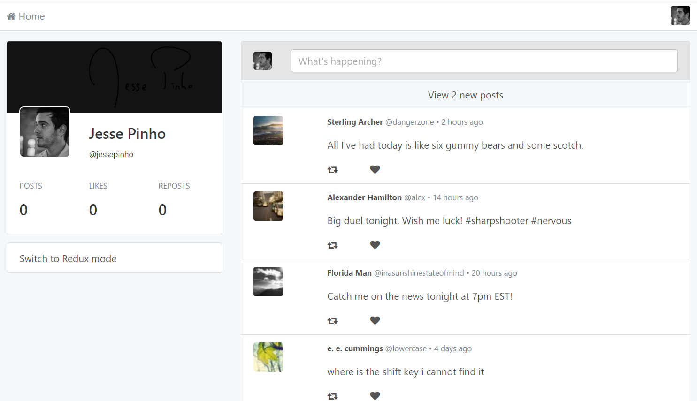

For a great tutorial on this app, watch this video by the author, Jesse Pinho, coder at Groupon:

<a href= "https://www.youtube.com/watch?v=Q9iSjFbPjPo">What the Heck is Redux? with Jesse Pinho</a>

The video description sums it up nicely:

"This talk is all about the question, "What the heck is Redux?" To answer it, we'll dive into the code of a simple Twitter clone that has two versions: one without Redux, and one with. We'll address the challenges of developing Twitter without Redux -- managing app state, keeping data consistent among components, etc. -- and then take a look at how Redux answers these challenges."
<br>
<br>

- [Features](#features)
- [Prerequisites](#prerequisites)
- [Getting Started](#getting-started)


Features
--------

- Angular 2
- Redux
- Twitter Clone
- Redux DevTools Chrome extension


Prerequisites
--------

Node.js and npm are essential to Angular development. 
    
<a href="https://docs.npmjs.com/getting-started/installing-node" target="_blank" title="Installing Node.js and updating npm">
Get it now</a> if it's not already installed on your machine.
 
**Verify that you are running at least node `v4.x.x` and npm `3.x.x`**
by running `node -v` and `npm -v` in a terminal/console window.
Older versions produce errors.


Getting Started
---------------

The easiest way to get started is to clone the repository:

```bash
# Get the latest snapshot
git clone https://github.com/ElishaKay/Angular-2-Spotify-App.git

# Change directory
cd into the project

# Install NPM dependencies
npm install

# Install Jasmine Separately
npm install @types/jasmine@2.5.41

# Then simply start your app
npm start

# Your app will be available at:
http://localhost:4200


### Create a new git repo
You could [start writing code](#start-development) now and throw it all away when you're done.
If you'd rather preserve your work under source control, consider taking the following steps.

Initialize this project as a *local git repo* and make the first commit:
```bash
git init
git add .
git commit -m "Initial commit"
```

Create a *remote repository* for this project on the service of your choice.

Grab its address (e.g. *`https://github.com/<my-org>/my-proj.git`*) and push the *local repo* to the *remote*.
```bash
git remote add origin githubRepoUrl
git push origin master
